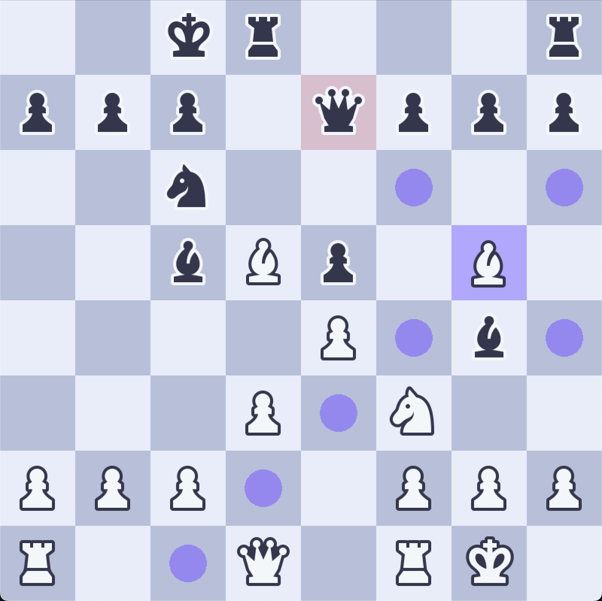

# Chess Game

## About

This is a simple chess game made in C++ using the SFML graphics library. It is a two player game, where each player takes turns moving their pieces. The game ends when one player's king is captured.

## Ideas for Future Development

- Add a AI to play against
- Add a timer for each player
- Add a menu screen
- Add a win screen
- Add a settings screen
- Add a save/load feature
- Add a tutorial

- [~] Implement undo for moves (the logic is already available)
- [~] Implement clicking on pieces (the logic is already available)

 

